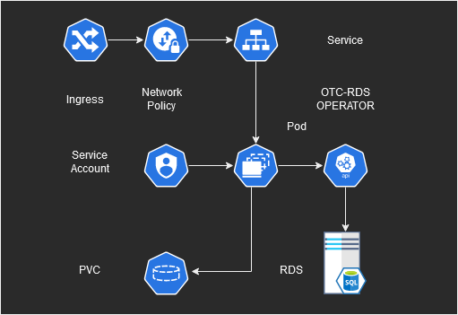

OTC RDS Operator Demoapp
========================



This demo is part of [OTC RDS Operator](https://github.com/eumel8/otc-rds-operator)
and deploy on a Kubernetes cluster and will use the following feature:

* Webapplication with UI
* MySQL backend (RDS OTC)
* Storage (requires default StorageClass in cluster)

Usage
-----

Ensure existing OTC VPC,Subnet, and SecurityGroup in `demoapp-rds.yaml`

and deploy manifest:

```bash
kubectl apply -f demoapp-rds.yaml
```

deploy manifest:

```bash
kubectl apply -f demoapp.yaml
```

If the cluster supports Ingress, adjust `demoapp-ingress.yaml` (e.g. hostname)
and deploy manifest:

```bash
kubectl apply -f demoapp-ingress.yaml
```

On Ingress endpoint in your browser should appear `Golang Mysql Curd Example`

Deep Dive
---------

Go:

```go
import (
	// ...
	"k8s.io/client-go/rest"
	rdsv1alpha1clientset "github.com/eumel8/otc-rds-operator/pkg/rds/v1alpha1/apis/clientset/versioned"
	metav1 "k8s.io/apimachinery/pkg/apis/meta/v1"
)
```

Import Kubernetes Go Rest Client, OTC RDS API clientset, and Kubernetes API Metadata

```go
	// ...
	for {
		log.Println("LOOP: get rds " + rdsname)
	
	rds, err := rdsclientset.McspsV1alpha1().Rdss(namespace).Get(context.TODO(), rdsname, metav1.GetOptions{})
		if err != nil {
			http.Error(w, err.Error(), http.StatusInternalServerError)
			log.Println("KRDS: " + err.Error())
			return nil, err
		}
		if rds.Status.Status == "ACTIVE" {
			log.Println("DB ACTIVE")
			for _, i := range *rds.Spec.Users {
				dbUser = i.Name
				dbPass = i.Password
				break
			}
			dbDriver := "mysql"
			dbHost := rds.Status.Ip
			dbPort := rds.Spec.Port
			dbName := rds.Spec.Databases[0]
			log.Println("DB CONNECT " + dbHost)
			db, err = sql.Open(dbDriver, dbUser+":"+dbPass+"@tcp("+dbHost+":"+dbPort+")/"+dbName)
			if err != nil {
				http.Error(w, err.Error(), http.StatusInternalServerError)
				log.Println("DBCONN: " + err.Error())
				return nil, err
			}
		}
		// ...
		time.Sleep(5 * time.Second)
	}
```

After in-cluster authentication on K8S API, create rdsclientset,
search for specific API and fetch, ip-address of RDS instance,
username/password of app user and try to connect

```go
func Index(w http.ResponseWriter, r *http.Request) {
	db, err := dbConn(w)
	if err != nil {
		http.Error(w, err.Error(), http.StatusInternalServerError)
		log.Println("DB: " + err.Error())
		return
	}
	selDB, err := db.Query("SELECT * FROM employee ORDER BY id DESC")
	if err != nil {
		http.Error(w, err.Error(), http.StatusInternalServerError)
		log.Println("INDEX: " + err.Error())
		return
	}
	emp := Employee{}
	res := []Employee{}
	for selDB.Next() {
		var id int
		var name, city, photo string
		err = selDB.Scan(&id, &name, &city, &photo)
		if err != nil {
			http.Error(w, err.Error(), http.StatusInternalServerError)
			log.Println("INDEX 2: " + err.Error())
			return
		}
		emp.Id = id
		emp.Name = name
		emp.City = city
		if photo != "none" {
			f, err := os.Open(dataDir + "/" + photo)
			if err != nil {
				// http.Error(w, err.Error(), http.StatusInternalServerError)
				log.Println("INDEX : photoload " + err.Error())
				// return
			} else {
				img, _, err := image.Decode(f)
				sane := resize.Resize(100, 100, img, resize.Bilinear)
				var buff bytes.Buffer
				png.Encode(&buff, sane)

				encodedString := base64.StdEncoding.EncodeToString(buff.Bytes())
				emp.Photo = encodedString
				if err != nil {
					http.Error(w, err.Error(), http.StatusInternalServerError)
					log.Println("INDEX : photodecode" + err.Error())
					return
				}
			}
			defer f.Close()
		} else {
			emp.Photo = "iVBORw0KGgoAAAANSUhEUgAAAJoAAAB/CAYAAAAXdtsmAAAAAXNSR0IArs4c6QAAAARnQU1BAACxjwv8YQUAAAAJcEhZcwAAFiUAABYlAUlSJPAAAAFdSURBVHhe7dKxAYAwDMCw0P9/Boa+EE/S4gf8vL+BZecWVhmNhNFIGI2E0UgYjYTRSBiNhNFIGI2E0UgYjYTRSBiNhNFIGI2E0UgYjYTRSBiNhNFIGI2E0UgYjYTRSBiNhNFIGI2E0UgYjYTRSBiNhNFIGI2E0UgYjYTRSBiNhNFIGI2E0UgYjYTRSBiNhNFIGI2E0UgYjYTRSBiNhNFIGI2E0UgYjYTRSBiNhNFIGI2E0UgYjYTRSBiNhNFIGI2E0UgYjYTRSBiNhNFIGI2E0UgYjYTRSBiNhNFIGI2E0UgYjYTRSBiNhNFIGI2E0UgYjYTRSBiNhNFIGI2E0UgYjYTRSBiNhNFIGI2E0UgYjYTRSBiNhNFIGI2E0UgYjYTRSBiNhNFIGI2E0UgYjYTRSBiNhNFIGI2E0UgYjYTRSBiNhNFIGI2E0UgYjYTRSBiNhNFIGI2E0UgYjcDMB+WSBPrvm9bgAAAAAElFTkSuQmCC"
		}
		res = append(res, emp)
	}
	tmpl.ExecuteTemplate(w, "Index", res)
	defer db.Close()
```

Using [Go text/template package](https://pkg.go.dev/text/template) to provide HTML views
for the web app. Form data are stored in MySQL database. The user can upload a file,
which is stored on specific data dir.

```go
func main() {
	log.Println("Server started on: :8080")
	http.HandleFunc("/", Index)
	http.HandleFunc("/show", Show)
	http.HandleFunc("/new", New)
	http.HandleFunc("/edit", Edit)
	http.HandleFunc("/insert", Insert)
	http.HandleFunc("/update", Update)
	http.HandleFunc("/delete", Delete)
	http.ListenAndServe(":8080", nil)
}
```

Routing of http handler to different function. Service web app on port :8080

```yaml
---
apiVersion: apps/v1
kind: StatefulSet
spec:
  template:
    spec:
      containers:
      - image: ghcr.io/eumel8/demoapp:1.0.0
        name: demoapp
        ports:
        - containerPort: 8080
        env:
        - name: MYSQL_NAME
          valueFrom:
            fieldRef:
              fieldPath: spec.serviceAccountName
        - name: MYSQL_NAMESPACE
          valueFrom:
            fieldRef:
              fieldPath: metadata.namespace
        - name: DATA_DIR
          value: "/data" # external pvc
        volumeMounts:
        - mountPath: /data
          name: demoapp-volume
      serviceAccountName: demoapp
      volumes:
      - name: demoapp-volume
        persistentVolumeClaim:
          claimName: demoapp-volume
```

Use K8S metadata for `MYSQL_NAME` and `MYSQL_NAMESPACE`,
Attach external PVC to the web app container, and expose containerPort 8080

